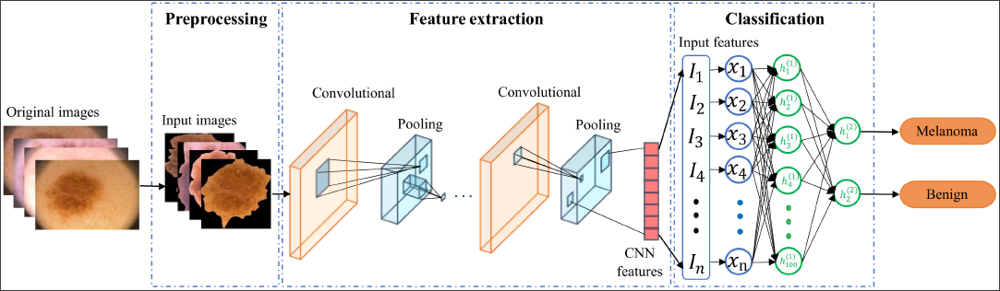
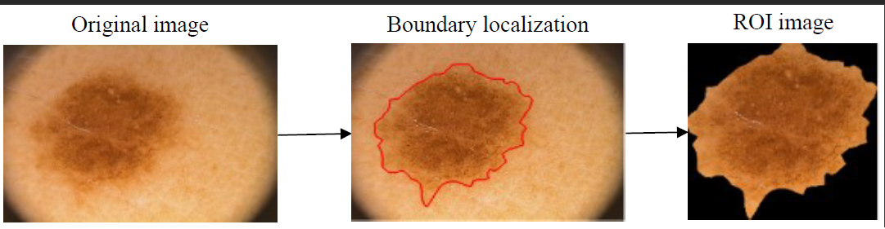
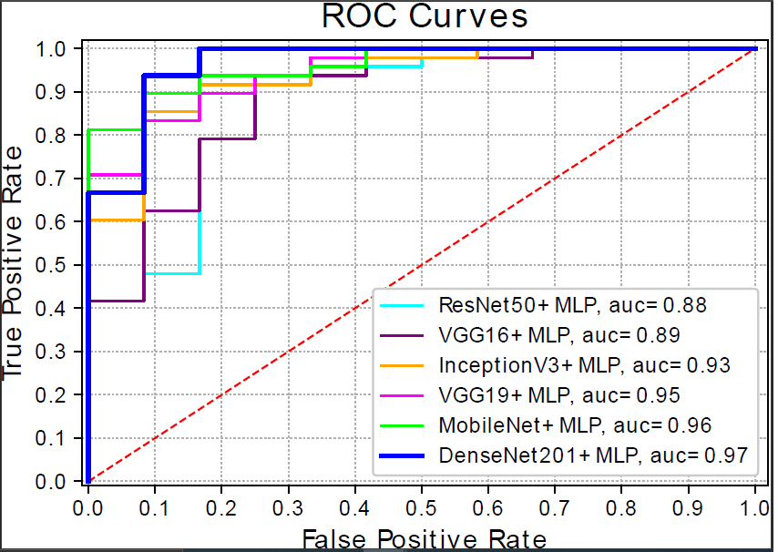

# Exploring_Deep_Features_for_Efficient_Melanoma
We propose an automated method for melanoma detection from dermoscopic images using high-level features derived from an effective CNN architecture.

Abstract: 

Melanoma is the most dangerous and lethal kind of skin cancer, and its high mortality rate is a major public health concern worldwide. Hence, detecting melanoma at the early stages is essential to ensure a high survival rate. In recent years, convolution neural networks (CNNs) based automated methods have gained attractions for early melanoma diagnosis. However, deriving meaningful features from dermoscopic images is challenging due to several reasons, such as inter-class consistency, intra-class variability, and insufficient training data. To tackle this problem, we propose an automated method for melanoma detection from dermoscopic images using high-level features derived
from an effective CNN architecture. The proposed method first preprocesses the images using boundary localization and cropping to generate images containing only essential parts, i.e., lesion regions. Then, the preprocessed images are input to a pre-trained CNN architecture to extract the high-level representations, followed by a multi-layer perceptron (MLP) for the classification of skin images. The PH2 benchmark dataset is used to evaluate our proposed method. The experimental findings show that the method (DenseNet201+MLP) achieves promising performance compared to other existing approaches

Introduction:

Deep learning algorithms, particularly CNNs, often discover useful features when given a large amount of training data. However, the limited skin cancer images available in open-sourced datasets make CNN’s training more challenging. Further, the inter-class consistency and intraclass variability cause the models to be arduous in deriving prominent features from skin images. Although few pretrained
CNN models were employed, they mainly focused on the extraction of visual features from the whole skin images but not from the skin lesion regions, which usually results in extracting unnecessary features from outside the skin lesion boundary. Furthermore, the effectiveness of many recent CNN architectures has not yet been investigated over skin lesion images. In this paper, we present an automated classification method for melanoma identification, in which a pre-trained CNN model is utilized to generate meaningful
visual representations only from the lesion regions, and a series of classifiers are used to perform the classification task.

contributions to this work are as follows:

• We employ skin lesion border localization and cropping, which mainly extract the lesion regions from the skin images and eliminate the irrelevant information from the skin images.
• We adopt a pre-trained deep CNN architecture to extract prominent features from the lesion images, It ultimately solves the issue of inadequate training data.
• We compare the effectiveness of feature representations obtained from different CNN models along with a set of standard classifiers on a benchmark dataset. The combination (DenseNet201 and MLP) outperforms other combinations as well as state-of-the-art schemes.

Proposed Methodology:

The proposed melanoma classification method extracts more relevant features from the skin lesion region using pre-train CNN models. Further, a set of a classifier is used to carry out the classification. The detailed pipeline of the proposed method is illustrated in Figure. The method consists of three primary stages, namely, 1) Preprocessing, 2) feature extraction, and 3) classification.

Boundary localization:

Dermoscopic images are captured with high resolution, different sizes and may be corrupted by noise due to the electronic dermatoscope or other incidental factors that affect the originality of images. It has unidentified particles such as lines on the skin, air bubbles and hair, all of which may be found in almost each image. Boundary localization techniques are crucial for locating the lesion’s borders so that the unneeded tissue may be excised and the vital tissue extracted. Cropping just the most important parts of an image may help clean up the input data and make it easier to pull out useful information. Figure depicted an example of boundary localization and region of
interest (ROI) extraction from a sample dermoscopy image.

Experiments with Different CNN Architecture:

The ROC curve of different CNN models using PH2 datasets are shown in Figure. With an AUC of 97%, it is observed that DenseNet201+MLP outperforms compared to other deep CNN models that we tested.

This work is published in 20th OITS International Conference on Information Technology (OCIT) (SCOPUS), Bhubaneswar, India, IEEE.
You can find a published paper at: https://ieeexplore.ieee.org/document/10053820
